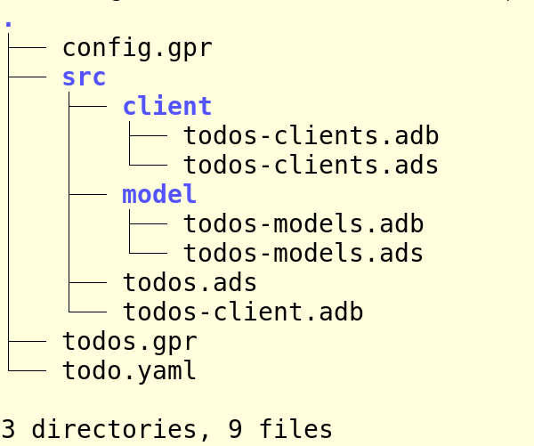

# Tutorial

This small tutorial explains how you can write the OpenAPI document that describes
the REST operation and use it to build the client and server.

The OpenAPI framework is composed of:

   * A code generator provided by [OpenAPI Tools](https://github.com/stcarrez/dynamo),
   * A core runtime,

The tutorial application is a simple todo client and server that provides creation, list, update and delete operations.

## Defining the OpenAPI description

The first step is to write the OpenAPI description either in JSON or in YAML.  JSON is the prefered format to catch
more syntaxic errors but YAML is somewhat easier to read.

   * Using an UML modeling tool such as [ArgoUML](https://github.com/argouml-tigris-org/argouml),
   * Writing an XML file following the [Hibernate](https://www.hibernate.org/) description,
   * Writing a YAML description according to the [Doctrine](https://www.doctrine-project.org/projects/doctrine-orm/en/2.6/reference/yaml-mapping.html) mapping.

In all cases, the model describes the data table as well as how the different
columns are mapped to an Ada type.  The model can also describe the relations between
tables.  XML and YAML data model files should be stored in the `db` directory.

### General Description

A first part of the OpenAPI document provides a general description of the API.
This includes the general description, the terms of service, the license and some contact information.

```
openapi: 3.0.0
servers:
  - url: 'https://todo.vacs.fr/v1'
  - url: 'http://todo.vacs.fr/v1'
info:
  title: Todo API
  description: Todo API
  version: 1.0.0
  termsOfService: 'https://todo.vacs.fr/terms/'
  contact:
    email: Stephane.Carrez@gmail.com
  license:
    name: Apache 2.0
    url: 'http://www.apache.org/licenses/LICENSE-2.0.html'
tags:
  - name: tasks
    description: Tasks
```

### Type description

The OpenAPI document can also describe types which are used by the REST operations.
These types provide a description of how the data is organized and passed through the API operations.

It is possible to describe almost all possible types from simple properties, group of properties
up to complex types including arrays.  For example a Todo type is made of several properties
each of them having a name, a type and other information to describe how the type is serialized.

```
components:
  schemas:
    Todo:
      type: object
      properties:
        id:
          type: integer
          format: int64
          description: The todo identifier
        title:
          type: string
          description: The todo title
        create_date:
          type: string
          format: date-time
          description: The todo creation date
        done_date:
          type: string
          format: date-time
          description: The todo resolution date
        status:
          type: string
          description: The todo state
          enum:
            - waiting
            - working
            - done
      required:
        - id
        - title
        - status
        - create_date
      example:
        id: 23
        title: Make the FOSDEM presentation
        description: password
        status: working
        create_date: '2017-12-24T00:00:00.000Z'
      xml:
        name: Todo
```

In this example, the `Todo` type contains 6 properties: `id`, `title`, `create_date`, `done_date` and `status`.
An `example` section is optional and gives an example of data content for the type.


### Security description

Because security is critical for most REST server, the OpenAPI document contains a section
that describes the security rules that must be met by the client and enforced by the server.

The `security` section describes the security schemes that are used by the server.
Then, each security scheme is described within the `components` section.

```
security:
  - todo_auth: []
components:
  securitySchemes:
    todo_auth:
      type: oauth2
      flows:
        password:
          tokenUrl: 'http://localhost:8080/v1/oauth/token'
          scopes:
            'write:todo': Write a todo
            'read:todo': Read a todo
```

This example defines an OAuth2 security scheme labeled `todo_auth`.  This security scheme
defines the `tokenUrl` entry point for the OAuth2 authorization and defines the scopes
supported by the security scheme.  The `todo_auth` label is then used to refer to this security
scheme in other description part of the OpenAPI document.

### Operation description

Operations are introduced by the `paths` object in the OpenAPI document.
This section describes the possible paths that can be used by URL and the associated operation.
Some operations receive their parameter within the path and this is represented by the `{name}` notation.

The operation description indicates the HTTP method that is used: `get`, `post`, `put` or `delete`.

Each operation is associated with a unique `operationId` that will be used by the code generator to
generate the procedure name that represents the operation.

The following definition describes the `createTodo` operation.
The operation is associated with the `todo_auth` security scheme and requires the `write:todo` scope.

```
paths:
  /todos:
    post:
      tags:
        - tasks
      summary: Create a todo
      description: ''
      operationId: createTodo
      responses:
        '200':
          description: successful operation
          content:
            application/json:
              schema:
                $ref: '#/components/schemas/Todo'
        '405':
          description: Invalid input
      security:
        - todo_auth:
            - 'write:todo'
      requestBody:
        content:
          application/x-www-form-urlencoded:
            schema:
              type: object
              properties:
                title:
                  description: The todo title
                  type: string
              required:
                - title
```

The `summary` and `description` are used for the documentation purposes.
The `operationId` is used by code generators to provide an operation name that a target programming language can use.
The `produces` section indicates the media types that are supported by the operation and which are generated for the response.
It must contain a valid mime type such as `application/json`, `application/xml` or `application/x-www-form-urlencoded`.

The `parameters` section represents all the operation parameters.
Some parameters can be extracted from the path and some others can be passed as query parameter.

The `responses` section describes the possible responses for the operation as well as the format used by the response.
Again, it must be a valid mime type.  In this example, the operation returns an object described by the `Todo` type.

## Writing the REST client

### Generating the REST client APIs

With the OpenAPI document, we can now generate the REST client Ada support to call the operations
described by the OpenAPI document.  The code generator uses several options that are specific
to the Ada code generator:

* A `--model-package` option allows to control the name of the Ada package that will contain the definicitons,
* A `--additional-properties projectName=todos` option defines the name of the GNAT project name.

The code generator itself is selected by the `--generator-name` option and choosing the `ada` generator
will generate the REST Ada client:

```
openapi-generator generate --generator-name ada -i todo.yaml --additional-properties projectName=todos --model-package Todos -o .
```

The code generator will produce the following files:



### Client Setup

The HTTP/REST support is provided by Ada Util and encapsulated by OpenAPI Ada library.
The Ada Util library also takes care of the JSON, XML and form serialization and deserialization.
If you want to use Curl, you should initialize with the following:


```
with Util.Http.Clients.Curl;
...
   Util.Http.Clients.Curl.Register;
```

###

