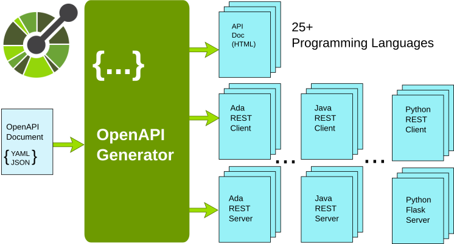

# Introduction

The [OpenAPI Specification](https://github.com/OAI/OpenAPI-Specification) defines a programming language-agnostic interface to describe a REST API.
The OpenAPI initiative aims at defining a standard for the specification of REST API.
The [OpenAPI Generator](https://github.com/OpenAPITools/openapi-generator) is a code generator that
supports more than 28 different languages, including Ada, and it is able to read an OpenAPI document
and generates either the documentation or the client and server REST code for several target languages.
By using the OpenAPI, it is possible to write the REST server implementation in one programming language
and write the REST client in another.

The OpenAPI Ada library is a small support library for the Ada code generator
provided by OpenAPI Generator.  The library provides support to serialize the data,
make HTTP requests and support the [OpenAPI Specification](https://github.com/OAI/OpenAPI-Specification)
specific operations or types.

The development process is the following:

  * You write the OpenAPI description file that describes the REST server operations,
  * You generate the Ada client and server code by using the [OpenAPI Generator](https://github.com/OpenAPITools/openapi-generator).
  * You write your application on top of the generated code that gives you direct and simplified access to REST operations.

This document describes how to build the library and how you can use
the OpenAPI code generator to implement the REST client or server using Ada as programming language.

